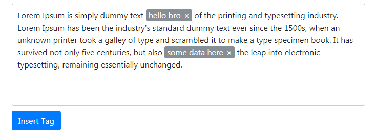

# Tagger #

Tagger is a convenient tool that allows inserting tags in any part of the text, just like Google does with their smileys. The point is, these tags are programmable and can have any rule or formula set beneath.

For example, you can create the rules for these tags to cover the daily sales reports, where only a few essential numbers change. These updates will be calculated upon inserting the tag into the text, so preparing a report will require quite little time and manual effort!

[Live example](https://it-svit.github.io/tagger/)
